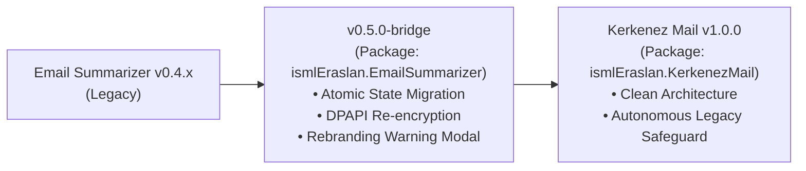
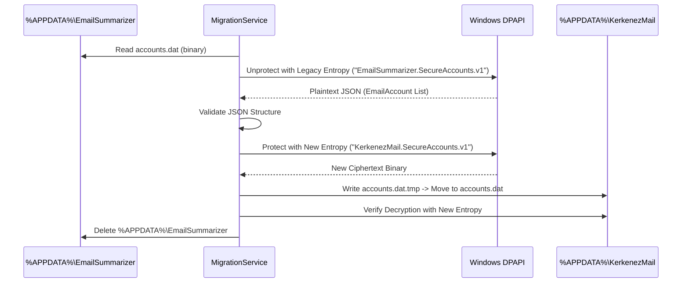
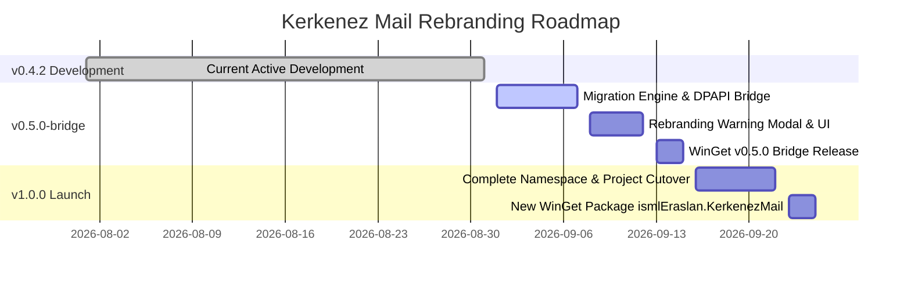

# 🦅 Kerkenez Mail: Rebranding & Transition Master Plan

> **Architectural Audit, Legacy State Migration Engine, `v0.5.0-bridge` Transition Release, and `v1.0.0` Brand Launch**  
> *Target Project:* **Email Summarizer (Win32)** $\rightarrow$ **Kerkenez Mail**  
> *Author:* Ahmet İsmail Eraslan & DeepMind / Antigravity Engineering  
> *Target Release Cycle:* v0.5.0-bridge $\rightarrow$ v1.0.0  

---

## 📑 Table of Contents

1. [Executive Summary & Rebranding Strategy](#1-executive-summary--rebranding-strategy)
2. [Complete Codebase Feature & Architectural Inventory](#2-complete-codebase-feature--architectural-inventory)
   - [2.1 Core Lifecycle Architecture](#21-core-lifecycle-architecture)
   - [2.2 Data Persistence & DPAPI Cryptography](#22-data-persistence--dpapi-cryptography)
   - [2.3 Multi-Account IMAP Engine & MailKit Integration](#23-multi-account-imap-engine--mailkit-integration)
   - [2.4 Local & Cloud AI Inference Pipeline](#24-local--cloud-ai-inference-pipeline)
   - [2.5 Low-Footprint Win32 System Tray Daemon](#25-low-footprint-win32-system-tray-daemon)
   - [2.6 Windows OS Shell Integrations](#26-windows-os-shell-integrations)
   - [2.7 CI/CD Pipeline & Windows Package Manager (WinGet)](#27-cicd-pipeline--windows-package-manager-winget)
3. [Exhaustive Inventory of All Legacy Identifiers & Paths](#3-exhaustive-inventory-of-all-legacy-identifiers--paths)
4. [Stage 1: The `v0.5.0-bridge` Transition Vehicle](#4-stage-1-the-v050-bridge-transition-vehicle)
   - [4.1 Bridge Objectives & WinGet Identity](#41-bridge-objectives--winget-identity)
   - [4.2 Universal Migration Engine (`MigrationService`)](#42-universal-migration-engine-migrationservice)
   - [4.3 DPAPI Credential & Secret Re-encryption Architecture](#43-dpapi-credential--secret-re-encryption-architecture)
   - [4.4 Roaming AppData Atomic Cutover & Verification Protocol](#44-roaming-appdata-atomic-cutover--verification-protocol)
   - [4.5 Windows Registry & Startup Run Key Seamless Migration](#45-windows-registry--startup-run-key-seamless-migration)
   - [4.6 Windows Shortcut Relocation & Cleanup](#46-windows-shortcut-relocation--cleanup)
   - [4.7 Persistent Rebranding Startup Notice & User Migration Modal](#47-persistent-rebranding-startup-notice--user-migration-modal)
   - [4.8 Bridge Clean Uninstaller Support](#48-bridge-clean-uninstaller-support)
   - [4.9 Bridge WinGet Manifest for `ismlEraslan.EmailSummarizer`](#49-bridge-winget-manifest-for-ismleraslanemailsummarizer)
5. [Stage 2: The Kerkenez Mail `v1.0.0` Official Release](#5-stage-2-the-kerkenez-mail-v100-official-release)
   - [5.1 Clean Codebase & Project Renaming Map](#51-clean-codebase--project-renaming-map)
   - [5.2 Permanent Legacy Auto-Import Safeguard in v1.0.0](#52-permanent-legacy-auto-import-safeguard-in-v100)
   - [5.3 New WinGet Package Manifest: `ismlEraslan.KerkenezMail`](#53-new-winget-package-manifest-ismleraslankerkenezmail)
6. [Step-by-Step Implementation Roadmap](#6-step-by-step-implementation-roadmap)
7. [Edge Cases, Safety Guards & Recovery Protocols](#7-edge-cases-safety-guards--recovery-protocols)
8. [Verification, Quality Assurance & Testing Matrix](#8-verification-quality-assurance--testing-matrix)

---

## 1. Executive Summary & Rebranding Strategy

The project **"Email Summarizer (Win32)"** (Repository: `ismlEraslan/email-summarizer-win32`, WinGet: `ismlEraslan.EmailSummarizer`) is undergoing a complete, permanent rebranding to **Kerkenez Mail**.



### The Rebranding Scope
* **Application Binary & Executable Name:** `KerkenezMail.exe`
* **Application Title & Branding:** `Kerkenez Mail (Win32)` / `Kerkenez Mail`
* **Roaming AppData Directory:** `%APPDATA%\KerkenezMail`
* **DPAPI Cryptographic Entropies:** `KerkenezMail.SecureAccounts.v1` & `KerkenezMail.SecureSecrets.v1`
* **Windows Registry Uninstall Key:** `HKCU\Software\Microsoft\Windows\CurrentVersion\Uninstall\KerkenezMail`
* **Windows Logon Startup Run Key:** `HKCU\Software\Microsoft\Windows\CurrentVersion\Run\KerkenezMailTray`
* **Windows Kernel Mutexes & Events:** `Global\KerkenezMail_MainUI_Mutex`, `Global\KerkenezMail_TrayDaemon_Mutex`, `Global\KerkenezMail_TrayDaemon_ExitEvent`
* **Windows Shell Shortcuts:** `%APPDATA%\Microsoft\Windows\Start Menu\Programs\Kerkenez Mail.lnk`, `%USERPROFILE%\Desktop\Kerkenez Mail.lnk`
* **Windows Package Manager (WinGet):** New package identifier `ismlEraslan.KerkenezMail`

### The Two-Stage Transition Strategy

> [!IMPORTANT]
> Because existing users have installed the app via `winget install ismlEraslan.EmailSummarizer` or standalone zip downloads, an abrupt change of package identifier on WinGet would leave users stranded on older builds without automated upgrade notifications. Therefore, a two-stage bridge transition is deployed.

1. **Stage 1: Release `v0.5.0-bridge` under the OLD WinGet Identifier (`ismlEraslan.EmailSummarizer`)**
   - Published as version `0.5.0`.
   - Embeds the comprehensive, fault-tolerant `MigrationService` that carries out the entire state migration on the user's machine automatically upon first launch.
   - Migrates encrypted accounts, preferences, registry keys, and shortcuts to the new `KerkenezMail` locations.
   - Displays a persistent, informative Rebranding Modal & Banner at startup informing users of the rebranding and providing one-click instructions to switch their WinGet package to `ismlEraslan.KerkenezMail`.
2. **Stage 2: Official Launch of `Kerkenez Mail v1.0.0`**
   - Target Version: `v1.0.0`
   - Published under the new WinGet identifier: `ismlEraslan.KerkenezMail`.
   - Clean, permanent codebase under `KerkenezMail.csproj` / `KerkenezMail.exe`.
   - Includes a silent legacy migration check so that any user jumping directly from v0.4.x to v1.0.0 without going through v0.5.0-bridge has their data seamlessly migrated.

---

## 2. Complete Codebase Feature & Architectural Inventory

### 2.1 Core Lifecycle Architecture
* **`Program.cs`**: Main entry point handling CLI modes:
  * `--uninstall` / `--uninstall --quiet`: Invokes `HandleUninstall` to remove registry keys, shortcuts, and AppData directories.
  * `UninstallRegistrationService.RegisterOrUpdate()`: Self-registers in `HKCU\Software\Microsoft\Windows\CurrentVersion\Uninstall` on every launch.
  * `--daemon` / `--tray`: Enters background tray daemon mode (`NativeTrayDaemon.Run()`), protected by single-instance mutex.
  * Normal GUI Mode: Acquires main UI mutex, focuses any existing window if already active, and launches `MainForm`.

### 2.2 Data Persistence & DPAPI Cryptography
* **`ConfigService.cs`**:
  * Stores settings in `%APPDATA%\EmailSummarizer\config.json`.
  * Manages account IDs and general preferences.
  * Contains legacy plain-text migration routines for backward compatibility.
* **`AccountCryptoService.cs`**:
  * Windows DPAPI encryption (`ProtectedData.Protect` / `ProtectedData.Unprotect`) with `DataProtectionScope.CurrentUser`.
  * Encrypts `accounts.dat` using application entropy.
  * Encrypts `CloudApiKeyEncrypted` in `config.json`.
  * Atomic file writes using temporary file swap (`.tmp` $\rightarrow$ rename).
* **`AppSettings.cs`**:
  * Strongly typed configuration model (LLM backend parameters, inference options, display scaling, email fetching limits, system prompt).

### 2.3 Multi-Account IMAP Engine & MailKit Integration
* **`ImapService.cs`**:
  * MailKit-powered asynchronous IMAP client (`ImapClient`) supporting SSL/TLS.
  * Live connection tester and unread counter.
  * Progressive streaming fetcher with real-time UI callbacks.
  * HTML sanitization (`ConvertHtmlToPlainText`) and tracking URL stripping.
  * Mailing list and newsletter header/footer heuristics (`List-Unsubscribe`, `List-ID`, `X-Campaign`, newsletter signatures).
  * Batch triage engine (archive and delete operations with dynamic folder resolution).

### 2.4 Local & Cloud AI Inference Pipeline
* **`LlamaServerManager.cs`**:
  * Manages embedded local `llama-server.exe` child process for GGUF models.
  * Bound to Windows Job Object (`JOB_OBJECT_LIMIT_KILL_ON_JOB_CLOSE`) ensuring child process is instantly killed by Windows OS if parent terminates.
  * Automatic health-check probing (`/health`) and on-demand GPU VRAM unloading.
* **`LlmSummarizerService.cs`**:
  * Multi-backend REST client for local `llama-server.exe`, local Ollama (`localhost:11434`), and Cloud providers (OpenAI, OpenRouter, Groq, DeepSeek).
  * Newsletter & marketing pre-classification prompt heuristics (Priority 3).
  * Chain-of-Thought (CoT) reasoning tag stripping (`<think>...</think>`, `[THINK]...[/THINK]`) for reasoning models like `DeepSeek-R1` and `QwQ`.
  * Priority parsing (`Priority: 1|2|3`) and executive summary extraction.

### 2.5 Low-Footprint Win32 System Tray Daemon
* **`NativeTrayDaemon.cs`**:
  * Headless Win32 message-only window loop with `Shell_NotifyIcon`.
  * Zero Windows Forms control memory overhead; idle memory footprint **$< 5\text{ MB}$ RAM**.
  * Balloon notifications for newly discovered unread emails.
* **`TrayDaemonService.cs`**:
  * Periodic background account polling (1–120 min) with aggressive memory working-set trimming (`NativeMethods.TrimWorkingSet()`).

### 2.6 Windows OS Shell Integrations
* **`UninstallRegistrationService.cs`**:
  * Self-registers application in Windows "Installed Apps" / "Add or Remove Programs" under `HKCU\Software\Microsoft\Windows\CurrentVersion\Uninstall`.
  * Manages Windows Logon startup run key under `HKCU\Software\Microsoft\Windows\CurrentVersion\Run`.
* **`ShortcutService.cs`**:
  * Creates and manages `.lnk` shortcuts on Desktop and Start Menu using COM `WScript.Shell`.

### 2.7 CI/CD Pipeline & Windows Package Manager (WinGet)
* **`.github/workflows/release.yml`**: Compiles single-file binary and creates GitHub Release zip asset.
* **`.github/workflows/winget.yml`**: Automates manifest creation and submission to `microsoft/winget-pkgs`.
* **`.github/scripts/publish-winget.ps1`**: Generates valid WinGet v1.6.0 manifests.

---

## 3. Exhaustive Inventory of All Legacy Identifiers & Paths

| Subsystem / Area | Current Legacy Value | Target Kerkenez Mail Value |
| :--- | :--- | :--- |
| **AppData Directory** | `%APPDATA%\EmailSummarizer` | `%APPDATA%\KerkenezMail` |
| **Config File** | `%APPDATA%\EmailSummarizer\config.json` | `%APPDATA%\KerkenezMail\config.json` |
| **Accounts Storage** | `%APPDATA%\EmailSummarizer\accounts.dat` | `%APPDATA%\KerkenezMail\accounts.dat` |
| **Registry Uninstall Key** | `HKCU\...\Uninstall\EmailSummarizer` | `HKCU\...\Uninstall\KerkenezMail` |
| **Registry Run Key Value** | `EmailSummarizerTray` | `KerkenezMailTray` |
| **DPAPI Accounts Entropy** | `EmailSummarizer.SecureAccounts.v1` | `KerkenezMail.SecureAccounts.v1` |
| **DPAPI Secrets Entropy** | `EmailSummarizer.SecureSecrets.v1` | `KerkenezMail.SecureSecrets.v1` |
| **Main UI Mutex** | `Global\EmailSummarizer_MainUI_Mutex` | `Global\KerkenezMail_MainUI_Mutex` |
| **Tray Daemon Mutex** | `Global\EmailSummarizer_TrayDaemon_Mutex` | `Global\KerkenezMail_TrayDaemon_Mutex` |
| **Tray Exit Event** | `Global\EmailSummarizer_TrayDaemon_ExitEvent` | `Global\KerkenezMail_TrayDaemon_ExitEvent` |
| **Tray Window Class** | `EmailSummarizer_TrayMsgHost_<guid>` | `KerkenezMail_TrayMsgHost_<guid>` |
| **Desktop Shortcut** | `%USERPROFILE%\Desktop\Email Summarizer.lnk` | `%USERPROFILE%\Desktop\Kerkenez Mail.lnk` |
| **Start Menu Shortcut** | `%APPDATA%\...\Programs\Email Summarizer.lnk` | `%APPDATA%\...\Programs\Kerkenez Mail.lnk` |
| **Project File** | `EmailSummarizer.csproj` | `KerkenezMail.csproj` |
| **C# Root Namespace** | `EmailSummarizer.*` | `KerkenezMail.*` |
| **Assembly Title** | `Email Summarizer (Win32)` | `Kerkenez Mail (Win32)` |
| **Assembly Product** | `Email Summarizer` | `Kerkenez Mail` |
| **WinGet Package ID** | `ismlEraslan.EmailSummarizer` | `ismlEraslan.KerkenezMail` |
| **WinGet Moniker** | `emailsummarizer` | `kerkenezmail` |
| **Release Zip Asset** | `EmailSummarizer.zip` | `KerkenezMail.zip` |

---

## 4. Stage 1: The `v0.5.0-bridge` Transition Vehicle

### 4.1 Bridge Objectives & WinGet Identity
* **Release Version:** `v0.5.0`
* **WinGet Package Identifier:** `ismlEraslan.EmailSummarizer`
* **Asset Name:** `EmailSummarizer.zip` (`EmailSummarizer.exe`)
* **Role:** The self-contained transition bridge. When existing users upgrade via `winget upgrade ismlEraslan.EmailSummarizer`, this version executes the full state migration, re-encrypts DPAPI secrets, updates registry/shortcuts, and presents the rebranding instructions.

### 4.2 Universal Migration Engine (`MigrationService`)

```csharp
public static class MigrationService
{
    public static readonly string LegacyAppDataFolder = Path.Combine(
        Environment.GetFolderPath(Environment.SpecialFolder.ApplicationData),
        "EmailSummarizer");

    public static readonly string NewAppDataFolder = Path.Combine(
        Environment.GetFolderPath(Environment.SpecialFolder.ApplicationData),
        "KerkenezMail");

    public static MigrationResult ExecuteMigrationIfNeeded()
    {
        // 1. Stop legacy daemon if active
        // 2. Migrate and re-encrypt AppData files
        // 3. Migrate Windows Registry entries (Uninstall & Run)
        // 4. Migrate Desktop and Start Menu shortcuts
        // 5. Verify integrity before deleting legacy directory
    }
}
```

### 4.3 DPAPI Credential & Secret Re-encryption Architecture



### 4.4 Roaming AppData Atomic Cutover & Verification Protocol
1. `%APPDATA%\KerkenezMail` is created.
2. `accounts.dat` and `config.json` are decrypted using legacy entropy and re-encrypted using new entropy.
3. Newly written files are test-decrypted and validated in memory.
4. **Safety Guarantee:** If and only if verification passes 100%, `%APPDATA%\EmailSummarizer` is cleanly deleted. If any verification step fails, the legacy directory is preserved as a backup.

### 4.5 Windows Registry & Startup Run Key Seamless Migration
1. **Uninstall Key:**
   - Creates `HKCU\Software\Microsoft\Windows\CurrentVersion\Uninstall\KerkenezMail` (`DisplayName: "Kerkenez Mail"`).
   - Deletes `HKCU\Software\Microsoft\Windows\CurrentVersion\Uninstall\EmailSummarizer`.
2. **Startup Run Key:**
   - Creates `HKCU\Software\Microsoft\Windows\CurrentVersion\Run` $\rightarrow$ `KerkenezMailTray` = `"exePath" --daemon`.
   - Deletes legacy values `EmailSummarizerTray` and `EmailSummarizer`.

### 4.6 Windows Shortcut Relocation & Cleanup
- Scans for all instances of `Email Summarizer.lnk` on Desktop and Start Menu.
- Deletes legacy `.lnk` files and creates `Kerkenez Mail.lnk`.

### 4.7 Persistent Rebranding Startup Notice & User Migration Modal
On boot of `v0.5.0-bridge`, `MainForm` presents an informative modal / banner:

```
+---------------------------------------------------------------------------------------+
| ⚠️ REBRANDING NOTICE: Email Summarizer is now Kerkenez Mail!                           |
| All your accounts, settings, and encryption keys have been safely migrated to:        |
| %APPDATA%\KerkenezMail                                                                |
|                                                                                       |
| To continue receiving future updates, please install the official Kerkenez Mail:      |
| > winget install ismlEraslan.KerkenezMail                                             |
|                                                                                       |
| [ 📋 Copy WinGet Command ]      [ 🌐 Open GitHub Releases ]      [ Continue to App ]   |
+---------------------------------------------------------------------------------------+
```

### 4.8 Bridge Clean Uninstaller Support
Executing `EmailSummarizer.exe --uninstall` on the bridge release cleans up:
- Both `KerkenezMail` and `EmailSummarizer` registry uninstall entries.
- Both `KerkenezMailTray` and `EmailSummarizerTray` startup run entries.
- Both `Kerkenez Mail.lnk` and `Email Summarizer.lnk` shortcuts.
- Both `%APPDATA%\KerkenezMail` and `%APPDATA%\EmailSummarizer` directories.

### 4.9 Bridge WinGet Manifest for `ismlEraslan.EmailSummarizer`
- Version: `0.5.0`
- Description: `[Rebranded to Kerkenez Mail] Local AI-powered IMAP email summarizer. Version 0.5.0 is the transition bridge release that automatically migrates your encrypted accounts, settings, and shortcuts to Kerkenez Mail. After this update, please install 'ismlEraslan.KerkenezMail'.`

---

## 5. Stage 2: The Kerkenez Mail `v1.0.0` Official Release

### 5.1 Clean Codebase & Project Renaming Map

```
EmailSummerizer/ (Root)
│
├── KerkenezMail.csproj                    <-- Renamed from EmailSummarizer.csproj
├── app.ico                                <-- Multi-resolution application icon
├── Program.cs                             <-- namespace KerkenezMail
│
├── Models/
│   ├── AppSettings.cs                     <-- namespace KerkenezMail.Models
│   ├── EmailAccount.cs                    <-- namespace KerkenezMail.Models
│   └── EmailItem.cs                       <-- namespace KerkenezMail.Models
│
├── Services/
│   ├── ConfigService.cs                   <-- %APPDATA%\KerkenezMail
│   ├── AccountCryptoService.cs            <-- KerkenezMail.Secure* entropy
│   ├── MigrationService.cs                <-- Autonomous legacy migration engine
│   ├── ImapService.cs                     <-- MailKit IMAP engine
│   ├── LlamaServerManager.cs              <-- llama-server Job Object manager
│   ├── LlmSummarizerService.cs            <-- Multi-backend LLM client
│   ├── NativeMethods.cs                   <-- Win32 P/Invoke declarations
│   ├── NativeTrayDaemon.cs                <-- Win32 background daemon
│   ├── ShortcutService.cs                 <-- Windows shortcut manager
│   ├── TrayDaemonService.cs               <-- Background polling service
│   ├── TrayIconHelper.cs                  <-- Dynamic icon builder
│   └── UninstallRegistrationService.cs    <-- HKCU Uninstall manager
│
└── UI/
    ├── MainForm.cs                        <-- "Kerkenez Mail (Win32)"
    ├── AddAccountDialog.cs                <-- Account configuration dialog
    ├── TrayDaemonContext.cs               <-- Tray ApplicationContext
    ├── Controls/
    │   └── SidebarNav.cs                  <-- "Kerkenez Mail" brand rail
    └── Tabs/
        ├── SummariesView.cs               <-- Inbox & AI summaries
        ├── AccountsView.cs                <-- IMAP account cards
        ├── SettingsView.cs                <-- Options & backend config
        └── LogsView.cs                    <-- Live activity console
```

### 5.2 Permanent Legacy Auto-Import Safeguard in v1.0.0
Even in `v1.0.0`, `MigrationService.ExecuteMigrationIfNeeded()` runs on first boot. If a user skipped `v0.5.0-bridge` and upgraded directly from `v0.4.x` to `v1.0.0`, their data and registry entries are automatically detected, re-encrypted, and migrated to `%APPDATA%\KerkenezMail`.

### 5.3 New WinGet Package Manifest: `ismlEraslan.KerkenezMail`
- Package Identifier: `ismlEraslan.KerkenezMail`
- Package Name: `Kerkenez Mail`
- Moniker: `kerkenezmail`
- Command Alias: `KerkenezMail`
- Architecture: `x64` (Portable / Zip)

---

## 6. Step-by-Step Implementation Roadmap



### Phase 1: Bridge Migration Engine Development (`v0.5.0-bridge`)
1. Implement `Services\MigrationService.cs`.
2. Update `Services\AccountCryptoService.cs` with dual-entropy fallback.
3. Update `Services\ConfigService.cs` to trigger `MigrationService` on boot.
4. Update `Services\UninstallRegistrationService.cs` and `Services\ShortcutService.cs`.

### Phase 2: Bridge UI & Notification Integration
1. Add Rebranding Warning Banner and First-Launch Notice to `MainForm.cs`.
2. Update window titles, navigation headers, and tray context menus to `Kerkenez Mail`.
3. Update mutexes to `Global\KerkenezMail_MainUI_Mutex` and `Global\KerkenezMail_TrayDaemon_Mutex`.

### Phase 3: Bridge Release & WinGet Deployment (`v0.5.0`)
1. Set version to `0.5.0` in `EmailSummarizer.csproj`.
2. Publish `EmailSummarizer.exe` and `EmailSummarizer.zip`.
3. Submit manifest `ismlEraslan.EmailSummarizer` (`0.5.0`) to `microsoft/winget-pkgs`.

### Phase 4: Full Codebase Cutover to Kerkenez Mail (`v1.0.0`)
1. Rename `EmailSummarizer.csproj` $\rightarrow$ `KerkenezMail.csproj`.
2. Rename namespaces to `KerkenezMail.*`.
3. Update CI/CD workflows for `KerkenezMail.zip`.
4. Update `README.md`, `NOTICES`, and `LICENSE`.

### Phase 5: New WinGet Package Launch (`ismlEraslan.KerkenezMail` v1.0.0)
1. Submit new package `ismlEraslan.KerkenezMail` (`1.0.0`) to `microsoft/winget-pkgs`.

---

## 7. Edge Cases, Safety Guards & Recovery Protocols

* **Zero Data Loss Guarantee:** No legacy files are deleted until newly encrypted files pass structural parsing and test-decryption.
* **Legacy Daemon Conflict:** Active legacy daemons listening on `Global\EmailSummarizer_TrayDaemon_Mutex` are signaled via `Global\EmailSummarizer_TrayDaemon_ExitEvent` and gracefully shut down before the new daemon starts.
* **No Admin Elevation Required:** All registry operations target `HKEY_CURRENT_USER` (HKCU) and roaming user profile folders, requiring zero UAC prompts.
* **Corrupt Data Healing:** If legacy `config.json` is partially corrupt, `HealAndNormalizeSettings()` restores defaults while salvaging valid account IDs.

---

## 8. Verification, Quality Assurance & Testing Matrix

| Test Scenario | Action | Expected Outcome |
| :--- | :--- | :--- |
| **Fresh Install (v1.0.0)** | Launch on clean machine | `%APPDATA%\KerkenezMail` created, clean registry registration, zero legacy files. |
| **Bridge Upgrade (v0.4.x $\rightarrow$ v0.5.0)** | Run v0.5.0 over existing v0.4.x | Data decrypted and re-encrypted into `%APPDATA%\KerkenezMail`, legacy folder removed, rebranding modal shown. |
| **Direct Upgrade (v0.4.x $\rightarrow$ v1.0.0)** | Run v1.0.0 skipping bridge | Autonomous migration fires on boot, imports all accounts and settings seamlessly. |
| **Uninstaller Test** | Run `--uninstall` (and `--quiet`) | Cleans all registry keys, shortcuts, and AppData directories for both names. |

---

*This document is committed to the main branch as the official architectural specification for the Kerkenez Mail transition.*
